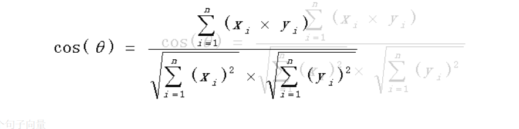
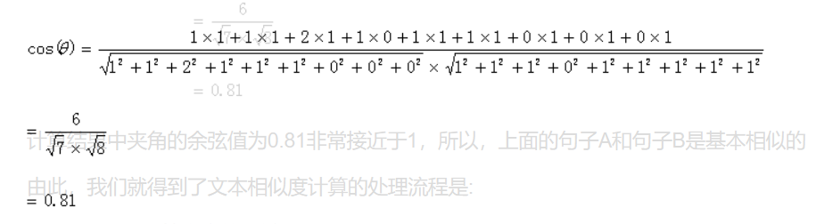

| 软件工程 | https://edu.cnblogs.com/campus/gdgy/informationsecurity1812  |
| -------- | :----------------------------------------------------------: |
| 作业要求 | https://edu.cnblogs.com/campus/gdgy/informationsecurity1812/homework/11155 |
| 作业目标 |     论文查重算法设计+单元测试+JProfiler+PSP表格+Git管理      |

## 整体流程

1. MainEntrance.main()方法进入程序
2. 将需要对比的文章转化为String列表，再将Sring列表进行分词，统计两篇文章中词频
3. 使用余弦算法进行相似度计算、
4. 输出结果到命令行

## 项目结构

## 论文查重算法设计

#### 第一步，分词**。**

句子A：这只/皮靴/号码/大了。那只/号码/合适。

句子B：这只/皮靴/号码/不/小，那只/更/合适。

#### 第二步，列出所有的词。

这只，皮靴，号码，大了。那只，合适，不，小，很

#### 第三步，计算词频。

句子A：这只1，皮靴1，号码2，大了1。那只1，合适1，不0，小0，更0

句子B：这只1，皮靴1，号码1，大了0。那只1，合适1，不1，小1，更1

#### 第四步，写出词频向量。

　　句子A：(1，1，2，1，1，1，0，0，0)

　　**句子B：(1，1，**1**，0，1，1，1，1，1)**

到这里，问题就变成了如何计算这两个向量的相似程度。我们可以把它们想象成空间中的两条线段，都是从原点（[0, 0,   ...]）出发，指向不同的方向。两条线段之间形成一个夹角，如果夹角为0度，意味着方向相同、线段重合,这是表示两个向量代表的文本完全相等；如果夹角为90度，意味着形成直角，方向完全不相似；如果夹角为180度，意味着方向正好相反。因此，我们可以通过夹角的大小，来判断向量的相似程度。夹角越小，就代表越相似。

计算两个句子向量，句子A：(1，1，2**，1，1，1，0，0，0)**和句子B：(1，1，1，0，1，1，1，1，1)的向量余弦值来确定两个句子的相似度。计算过程如下：

计算结果中夹角的余弦值为0.81非常接近于1，所以，上面的句子A和句子B是基本相似的

#### 总结原理

参考地址：[地址](https://blog.csdn.net/u012160689/article/details/15341303)

> ​    （1）找出两篇文章的关键词；
>
> 　（2）每篇文章各取出若干个关键词，合并成一个集合，计算每篇文章对于这个集合中的词的词频
>
> 　（3）生成两篇文章各自的词频向量；
>
> 　（4）计算两个向量的余弦相似度，值越大就表示越相似。

## 单元测试

## JProfiler

## PSP表格

| **PSP 各个阶段**                                             | 自己预估的时间（分钟） | 实际的记录（分钟） |
| ------------------------------------------------------------ | :--------------------: | :----------------: |
| **计划:** 明确需求和其他因素，估计以下的各个任务需要多少时间 |           30           |         50         |
| **开发** （包括下面 8 项子任务）                             |   （以下都填预估值）   |        240         |
| ·     需求分析 (包括学习新技术、新工具的时间)                |           20           |         20         |
| ·     生成设计文档 （整体框架的设计，各模块的接口，用时序图，快速原型等方法） |           15           |         15         |
| ·     设计复审 (和同事审核设计文档，或者自己复审)            |           15           |         40         |
| ·     代码规范 (为目前的开发制定或选择合适的规范)            |           5            |         10         |
| ·     具体设计（用伪代码，流程图等方法来设计具体模块）       |           20           |         30         |
| ·     具体编码                                               |           50           |         60         |
| ·     代码复审                                               |           5            |         10         |
| ·     测试（自我测试，修改代码，提交修改）                   |           10           |         60         |
| **报告**                                                     |           75           |         95         |
| 测试报告（发现了多少bug，修复了多少）                        |           15           |         30         |
| 计算工作量 (多少行代码，多少次签入，多少测试用例，其他工作量) |           10           |         20         |
| 事后总结, 并提出改进计划 （包括写文档、博客的时间）          |           50           |         50         |
| **总共花费的时间** （分钟）                                  |          200           |        450         |

## Git管理

## 总结

## 参考文档

- 原理参考：https://blog.csdn.net/u012160689/article/details/15341303
- 